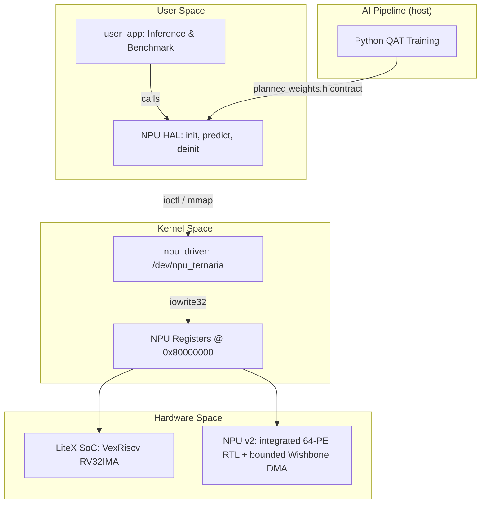

# Ternary Edge-RV: Full-Stack Multiplierless Edge AI Accelerator

[](https://opensource.org/licenses/MIT)
[-blue.svg)]()
[]()
[]()
[](paper/paper1_template.tex)
[-blue.svg)](http://www.realdigital.org/)

**Ternary Edge-RV** is a hardware-software co-design project aimed at studying energy-efficient Edge Artificial Intelligence. This repository contains the full source-level stack, from custom RTL and SoC architecture to the AI application, for a ternary Neural Processing Unit (NPU) targeted for integration into a Linux-capable RISC-V System-on-Chip (SoC).

This project is working toward **Phase 4: Physical Deployment and Paper 1** (target: SBCCI/LASCAS). The paper template is available at [`paper/paper1_template.tex`](paper/paper1_template.tex). The research question is whether heavily quantized models ($\in \{-1, 0, 1\}$) on custom hardware can improve latency and energy use relative to CPU execution; that comparison remains subject to physical measurement.

> **Historical snapshot (17/08/2026):** Earlier project notes contain unverified observations about the RealDigital Urbana board (AMD Spartan-7 XC7S50-CSGA324, 128 MB DDR3, MicroSD), micro-USB connectivity, and host device names. Those notes also recorded a 4/4 Verilog regression result and updated OpenXC7 flags (`-nolutram -nowidelut`). The 4/4 result and hardware observations are retained as dated history, not as current evidence from the present shell. The target completion date for SBCCI/LASCAS submission was 31/08/2026. The operational transition plan is defined in [`docs/planejamento/direcionamento_pos_gilvan.md`](docs/planejamento/direcionamento_pos_gilvan.md).

---

## 🎯 Project Overview & Academic Contribution

Traditional AI inference relies heavily on power-hungry floating-point Multiply-Accumulate (MAC) operations. **Ternary Edge-RV** avoids multipliers in the ternary PE path. The canonical RTL integrates 64 ternary PEs, a registered 64-to-1 reduction tree, a scalar INT32 accumulator, banked activations, and a three-stage postprocessor. Host-side Icarus, Verilator and generic Yosys evidence passes, while Vivado implementation and runtime measurements remain pending.

By using **Quantization-Aware Training (QAT)** and the **Straight-Through Estimator (STE)**, we constrain neural network weights to ternary values (-1, 0, 1). This mathematical simplification is intended to let the custom Neural Processing Unit (NPU) perform dense-layer operations using basic adders, subtractors, and multiplexers.

Raw hardware and a general-purpose OS address different requirements in IoT and Edge systems. Our research studies a **Co-Design approach**: offloading neural computation to a ternary NPU while retaining a lightweight **LiteX-generated VexRiscv SoC** targeted to run an **Embedded Linux OS**. The documented integration uses IRQ-driven Memory-Mapped I/O (MMIO), but CPU sleep, latency, power, and energy benefits await runtime, synthesis, and physical measurement.

### Key Innovations
* **Multiplierless Hardware:** The source-level design and host-side model use addition, subtraction, multiplexing, and zero-skipping for ternary operations. Physical DSP utilization awaits synthesis and a resource report.
* **NPU HAL Layer:** A source-level Hardware Abstraction Layer bridging the kernel driver and user application. The current contract assigns three ternary layers to the NPU and a `256->10` FP32 output classifier to the CPU; trained-header and physical-path validation remain pending.
* **Custom Linux Kernel Driver:** Source-level User-Space to Kernel-Space interfaces use custom `.ko` modules, MMIO, and an IRQ path. Physical interrupt behavior and any reduction in CPU polling remain unverified.
* **Benchmarking Plan:** `<sys/time.h>` profiling and CPU versus NPU comparison paths are documented, but latency, throughput, power, and energy results await a validated physical run.
* **Automated AI Pipeline:** A Python-based QAT pipeline packs 2-bit ternary weights into 32-bit headers. Gustavo owns its current maintenance and the `weights.h` contract. The current header contains the FP32 symbols, but its fallback values, including `0.01` and `0.1`, are not validated trained parameters.

---

## 🏗️ System Architecture

The documented project stack connects the AI application to the source-level hardware through the software, hardware, and host-side pipeline components below:



### Why a HAL?

The source-level NPU v2 computes ternary {+1, 0, -1} × INT8 operations in its PE path. The final classification layer (256→10) is documented as requiring FP32 weights and softmax on the CPU. The HAL exposes the `npu_init()` → `npu_predict()` → `npu_deinit()` interface, but its end-to-end contract with the exported weights and data transforms remains incomplete.

### Address and Evidence Boundary

The frozen current contract uses DDR at `0x40000000`, a 64 KiB NPU MMIO aperture at `0x80000000`, and IRQ 10. The canonical RTL exposes 17 valid offsets from `0x00` through `0x40`; unsupported offsets return Wishbone `ERR`. It supports up to eight software-programmed descriptors and uses single-beat Wishbone Classic DMA with `CTI=000`, `BTE=00`, downstream `ERR`, and a 256-cycle timeout. Physical map integration, resources, timing, bitstream, board behavior, and runtime results remain pending.

---

## 📂 Repository Structure

The repository is organized by domain to ensure a clear separation of concerns:

```text
TernaryEdge-RV/
├── docs/                   # Internal documentation, architecture specs, and planning
├── hardware/               # Hardware Engineering
│   ├── litex_soc/          # Python scripts for VexRiscv SoC generation via LiteX
│   └── npu_rtl/            # Verilog/VHDL source for the Ternary NPU and Testbenches
├── software/               # OS and Driver Stack
│   ├── os_buildroot/       # Buildroot configs, Patches, U-Boot, and Device Tree (.dts)
│   ├── npu_driver/         # LKM C source code, file_operations, and MMIO mapping
│   ├── npu_hal/            # NPU HAL: init, load_weights, predict, classifier, weights
│   └── user_app/           # User-space C application using the HAL API
├── ai_training/            # AI & Quantization Pipeline
│   ├── notebooks/          # QAT exploration and model training (Larq/Brevitas)
│   └── scripts/            # Automated extraction and weight packing (uint32_t)
└── paper/                  # LaTeX source code, planned benchmark artifacts, and references
```

---

## 📊 Current Operational Status

The current evidence boundary and active post-Gilvan organization are documented in [`docs/planejamento/direcionamento_pos_gilvan.md`](docs/planejamento/direcionamento_pos_gilvan.md). The four-author Paper 1 list remains unchanged and in the order Arthur, Gildo, Gustavo, Gilvan.

Current canonical host evidence includes focused Icarus tests and the 16/32/64-PE matrix passing, including a production-sized `784->1024->512->256` regression with nonuniform high-row weights: outputs 0..254 equal `65024`, while output 255 equals `-65024`. The Verilator lint matrix, generic Yosys synthesis and `synth_matrix`, presentation contract tests (11/11), and report-gate unit tests (12/12) also pass. C++ v2's 21/21 result is historical and secondary, not canonical proof. Vivado resources and timing, bitstream and board behavior, Linux boot, physical IRQ/DMA, trained-model inference, accuracy, latency, throughput, benchmarks, power, and energy remain pending.

| Domain | Active Operational Ownership | Current Status & Evidence |
|:-------|:-----------------------------|:--------------------------|
| **Hardware (RTL/SoC)** | Arthur Oliveira Gomes | Canonical integrated 64-PE v2 RTL, Icarus regression, Verilator lint, and generic Yosys synthesis/check pass in the hardware flake. Vivado implementation, bitstream, board behavior, and physical DMA/IRQ remain pending. |
| **Linux, OS & HAL** | Gildo Alves de Lima Junior | Buildroot infrastructure, Device Tree (`urrbana.dts`), NPU HAL (`libnpu_hal.a`), FP32 CPU Classifier, MicroSD preparation, Linux physical boot. |
| **AI Pipeline, Weights, Golden Model, Driver & Benchmarks** | Gustavo Alexandre dos Santos | Current AI pipeline maintenance, weight export and `weights.h` contract, Golden Model regression and maintenance, kernel driver, RV32 cross-compilation, physical validation coordination, CPU-versus-NPU benchmarks, and Paper 1 results and discussion. Historical QAT, ternary packing, and C++ Golden Model v2 contributions remain under Gilvan's credit. |
| **Paper 1 Authors** | Arthur, Gildo, Gustavo, Gilvan | All 4 original authors retained on paper submission draft for SBCCI/LASCAS (31/08/2026). |

### Arthur (Hardware): RTL, LiteX SoC, Verilog Regression, Synthesis & Bitstream
- ✅ **Phase 1 design record:** The frozen current contract is DDR `0x40000000`, NPU MMIO `0x80000000`, and IRQ 10. Physical cross-layer integration remains pending.
- ✅ **Phase 2:** `ternary_mac.v` multiplierless MAC, `npu_ternaria_top.v` v1 (Wishbone slave + FSM + IRQ).
- ✅ **Phase 3 canonical RTL:** NPU v2 integrates 64 ternary PEs (`ternary_mac_array.v`), a registered 64-to-1 tree (`adder_tree_64.v`), a scalar INT32 accumulator, banked activation buffers, a three-stage postprocessor, bounded single-beat Wishbone Classic DMA (`wishbone_master.v`), and a sequencer for up to eight software-programmed descriptors. Host evidence passes for focused Icarus tests, the 16/32/64-PE matrix, Verilator lint, and generic Yosys synthesis/check.
- ✅ **Current host regression:** The production-sized `784->1024->512->256` chain passes at 16, 32, and 64 PEs; outputs 0..254 equal `65024`, and the nonuniform final row produces `-65024` at output 255.
- ⏳ **Physical validation:** Vivado resource and timing reports, bitstream generation and loading, board behavior, Linux boot, and physical IRQ/DMA remain pending.

### Gildo (OS Infrastructure & HAL): Buildroot, Device Tree, HAL, Classifier & Linux Boot
- ✅ **Infrastructure & Buildroot:** RV32IMA defconfig, toolchain via `make sdk`, QEMU boot validation.
- ✅ **Device Tree & Config:** `urrbana.dts` target Device Tree, `CONFIG_HIGH_RES_TIMERS=y`, FAT32/ext4 RootFS support.
- ✅ **NPU HAL & Classifier (`libnpu_hal.a`):** `npu_hal.c`, `npu_classifier.c` (FP32 CPU fallback for 256->10 output layer), `npu_weights.c`.
- ✅ **Packages & Application:** Buildroot packages (`npu-ternaria`, `npu-hal`, `user-app`), `user_app.c` refactored with `--cpu`, `--file`, `--batch` flags.
- ⏳ **Phase 4 Deployment (17/08/2026):** MicroSD card preparation, final Buildroot image compilation (kernel 6.18.7 + OpenSBI 1.6 + RootFS), Linux physical boot on Urbana board.

### Gustavo (AI Pipeline, Weights, Golden Model, Driver & Benchmarks): Current Operational Owner
- ✅ **AI and model maintenance:** Owns the current Python pipeline, `weights.h` export contract, and C++ Golden Model regression and maintenance.
- ✅ **Current host evidence:** The canonical RTL and report gates pass. The historical C++ Golden Model v2 result is retained as 21/21 secondary host checks, not as canonical RTL proof.
- ✅ **Kernel Driver (`npu_driver.ko`):** Platform driver with `dma_alloc_coherent`, `mmap`, `devm_request_irq`, `wait_event_interruptible`.
- ✅ **Driver v3.0 Register Map:** The current ABI defines 17 MMIO offsets (`0x00`-`0x40`), with shared `npu_ioctl.h`.
- ✅ **Weights and export contract:** Maintains `weights.h`, the AI export format, and the RV32 cross-compilation workflow. The current FP32 symbols use fallback values and are not validated trained parameters.
- ⏳ **Physical validation coordination:** Coordinates the driver, RV32 cross-compilation, physical validation with Arthur and Gildo, CPU-vs-NPU benchmarks, and the Paper 1 results and discussion. No FPGA end-to-end inference or benchmark is currently proven.

### Gilvan (Historical AI Contribution): Retained & Credited
- ✅ Historical QAT pipeline (Larq + STE), ternary packing, and C++ Golden Model v2 retained in the repository record.
- ✅ Historical C++ Golden Model v2 result retained as 21/21 host-side checks; current regression maintenance belongs to Gustavo.
- ✅ Retained as 4th author on Paper 1.

### Active Target & Deadline
- **Target completion date:** 31/08/2026 for SBCCI/LASCAS submission.

---

## 🚀 Getting Started (Simulation & Deployment)

*(Detailed phase-by-phase execution instructions are located in the respective subdirectories).*

### 1. Prerequisites
* **Hardware:** Vivado/Quartus toolchains, LiteX environment, Verilator (for simulation).
* **Software:** Buildroot, 32-bit RISC-V Cross-Compiler (`riscv32-buildroot-linux-gnu-gcc`), QEMU.
* **AI:** Python 3.10+, TensorFlow 2.17+, Larq 0.13+.

### 2. Quick Workflow
1. **Train Model:** Run the Python pipeline in `ai_training/` to generate `weights.h`.
2. **Build OS:** Compile the Buildroot environment in `software/os_buildroot/` to generate the RootFS and Toolchain.
3. **Build HAL + user_app:** Cross-compile the NPU HAL and user application.
4. **Compile Driver:** Cross-compile the LKM in `software/npu_driver/`.
5. **Hardware Synthesis:** Generate the bitstream using LiteX in `hardware/` and flash your target FPGA.
6. **Run Inference after physical validation:** Boot Linux on the FPGA, load the driver (`insmod`), and execute the benchmark application.

### 3. Software Stack Architecture

```
user_app (inference + benchmark)
    │
    ▼  (uses)
NPU HAL (npu_init → npu_predict → npu_deinit)
    │  └─ npu_classifier (256→10 output layer)
    │  └─ npu_weights (weight loading)
    │
    ▼  (ioctl / mmap)
npu_driver (/dev/npu_ternaria, IRQ, DMA)
    │
    ▼  (Wishbone bus)
NPU v2 integrated source-level RTL (64 ternary PEs, Layer Sequencer)
```

### 4. AI Pipeline (ai_training/)

The AI pipeline uses **Larq** for Quantization-Aware Training with the Straight-Through Estimator (STE), producing strictly ternary weights `{-1, 0, +1}`.

```bash
# Run the full pipeline (train -> validate -> pack -> export)
cd ai_training
python3 scripts/run_pipeline.py
```

The pipeline is intended to generate `weights.h` for the NPU HAL, but the HAL/weights contract is incomplete and requires end-to-end validation:
- `quant_dense_weights[50176]`: Layer 0 (784->1024)
- `quant_dense_1_weights[32768]`: Layer 1 (1024->512)
- `quant_dense_2_weights[8192]`: Layer 2 (512->256)
- `output_weights[2560]`: Output layer FP32 symbol present in the current header, but fallback values are not validated trained parameters
- `output_bias[10]`: Output layer bias symbol present in the current header, but fallback values are not validated trained parameters

---

## 🔧 Target Hardware: RealDigital Urbana (Phase 4)

The project targets the **RealDigital Urbana** board, which satisfies all `requisitos_fpga.md` requirements:

| Component | Urbana Board | Project Requirement |
|:----------|:-------------|:--------------------|
| FPGA | AMD Spartan-7 **XC7S50-CSGA324** | Xilinx 7-series (Wishbone + LiteX) |
| Logic Cells | ~52K LUTs | >= 15K (VexRiscv Linux + NPU) |
| External RAM | 128 MB DDR3; address range requires validation against the generated LiteX map | >= 32 MB (Linux + RootFS) |
| Storage | MicroSD slot | Boot + RootFS (FAT32 + ext4) |
| Console | UART via FTDI micro-USB | Linux console @ 115200 baud |
| Programmer | FTDI over micro-USB | openFPGALoader / Vivado Hardware Manager |

### Hardware Synthesis (Arthur)

Vivado is the final production toolchain. openXC7 remains available only as
optional host-side corroboration.

**Production: Xilinx Vivado Design Suite 2026.1 (Spartan-7 + free Basic license):**
```bash
cd /home/arthur/Documents/Projects/TernaryEdge-RV
nix develop path:.#vivado
cd hardware/litex_soc
python3 base_soc.py --build --toolchain vivado  # Synthesize -> bitstream
python3 base_soc.py --load       # Load bitstream to SRAM (volatile)
python3 base_soc.py --flash      # Flash bitstream to SPI flash (persistent)
```

These Vivado build, load, and flash commands are user-run acceptance procedures, not completed evidence. No Vivado resource, timing, bitstream, board, boot, IRQ, DMA, inference, benchmark, power, or energy result is claimed here.

Vivado 2026.1 requires the free annual Vivado Basic license for synthesis and
implementation. Generate it in the AMD licensing portal and load the `.lic`
file into `~/.Xilinx` before building.

**Optional corroboration: openXC7 (yosys + nextpnr-xilinx + openFPGALoader):**
```bash
# Recommended on NixOS: use the repository-local flake
nix develop .#hardware
ternaryedge-setup-openxc7

# Build and flash
cd hardware/litex_soc
python3 base_soc.py --build --toolchain openxc7
python3 base_soc.py --load   # SRAM test (volatile)
python3 base_soc.py --flash  # SPI flash (persistent)
```

The flake provides the openXC7 database, `bbaexport`/`bbasm`, and the `xc7frames2bit` build. OpenXC7 synthesis flags in the platform configuration are updated to `-nolutram -nowidelut` to eliminate RAM256X1S and MUXF7/MUXF8 chains. Before synthesis, `ternaryedge-check-litex-board` must pass. An openXC7 build or load does not replace the accepted Vivado report gate or establish production resources/timing.

### SD Card Preparation (Gildo)

Two partitions on the MicroSD card:
- **Partition 1 (FAT32, ~64 MB):** `boot.json` + `boot.scr` (U-Boot) + Linux kernel `Image` + `rv32.dtb` (LiteX-generated, based on `urrbana.dts`)
- **Partition 2 (ext4, rest):** Buildroot RootFS including `/lib/modules/<ver>/npu_driver.ko`, `/usr/lib/libnpu_hal.a`, `/usr/bin/user_app`, `/root/mnist/*.raw` (test images)

### Planned FPGA Boot & Inference (Gildo with Gustavo coordinating validation)

No FPGA end-to-end inference or CPU-vs-NPU benchmark has been proven. The commands below are an acceptance procedure, not evidence of completed execution.

```bash
# On Urbana UART console (via micro-USB FTDI @ 115200):
# 1. OpenSBI -> U-Boot -> Linux boot from mmcblk0p2

# 2. Load the NPU kernel module
insmod npu_driver.ko
dmesg | grep npu         # Expect "NPU v2 probe successful. /dev/npu_ternaria ready"

# 3. Run baseline CPU inference (3-layer ternary MLP in software, no NPU)
./user_app --cpu --file /root/mnist/sample_7.raw

# 4. Run proposed NPU-accelerated inference after the physical path is validated
./user_app --file /root/mnist/sample_7.raw
#  Output: predicted class, confidence, time_copy_us, time_npu_us, time_output_us, time_total_us

# 5. Batch benchmark after validation (100 images) -> save CSV for Paper 1
./user_app --batch 100 --file /root/mnist/batch/  > benchmark_npu.csv
./user_app --cpu --batch 100 --file /root/mnist/batch/ > benchmark_cpu.csv
```

---

## 👥 The Team

This research project is collaboratively developed by:

* **Arthur Oliveira Gomes** - *Hardware Architecture, RTL & SoC Design* (Hardware RTL, LiteX SoC, Verilog regression, openXC7/Vivado synthesis, Bitstream generation)
* **Gildo Alves de Lima Junior** - *OS Infrastructure & NPU HAL* (Buildroot, Device Tree urrbana.dts, NPU HAL libnpu_hal.a, FP32 CPU Classifier, MicroSD preparation, Linux physical boot)
* **Gustavo Alexandre dos Santos** - *AI Pipeline, Weights, Golden Model, Kernel Driver & Benchmarking* (AI pipeline maintenance, weights.h contract and export, Golden Model regression, kernel driver npu_driver.ko, RV32 cross-compilation, physical validation coordination, CPU versus NPU benchmarks, Paper 1 results and discussion)
* **Gilvan Alves Pastor Junior** - *Historical Artificial Intelligence & Golden Model Contribution* (Historical QAT pipeline Larq/STE, ternary packing, C++ Golden Model v2 retained and credited)

---

## 📝 Citation

If you find this repository useful for your research, please consider citing our upcoming paper. The Paper 1 LaTeX template with full author list and section outline is at [`paper/paper1_template.tex`](paper/paper1_template.tex).

```bibtex
@article{TernaryEdgeRV2026,
  title={Ternary Edge-RV: A Multiplierless Ternary Neural Network Accelerator for RISC-V Linux Systems},
  author={Arthur Oliveira Gomes and Gildo Alves de Lima Junior and Gustavo Alexandre dos Santos and Gilvan Alves Pastor Junior},
  journal={TBD (SBCCI/LASCAS)},
  year={2026}
}
```

## 📄 License

This project is licensed under the MIT License - see the `LICENSE` file for details.
