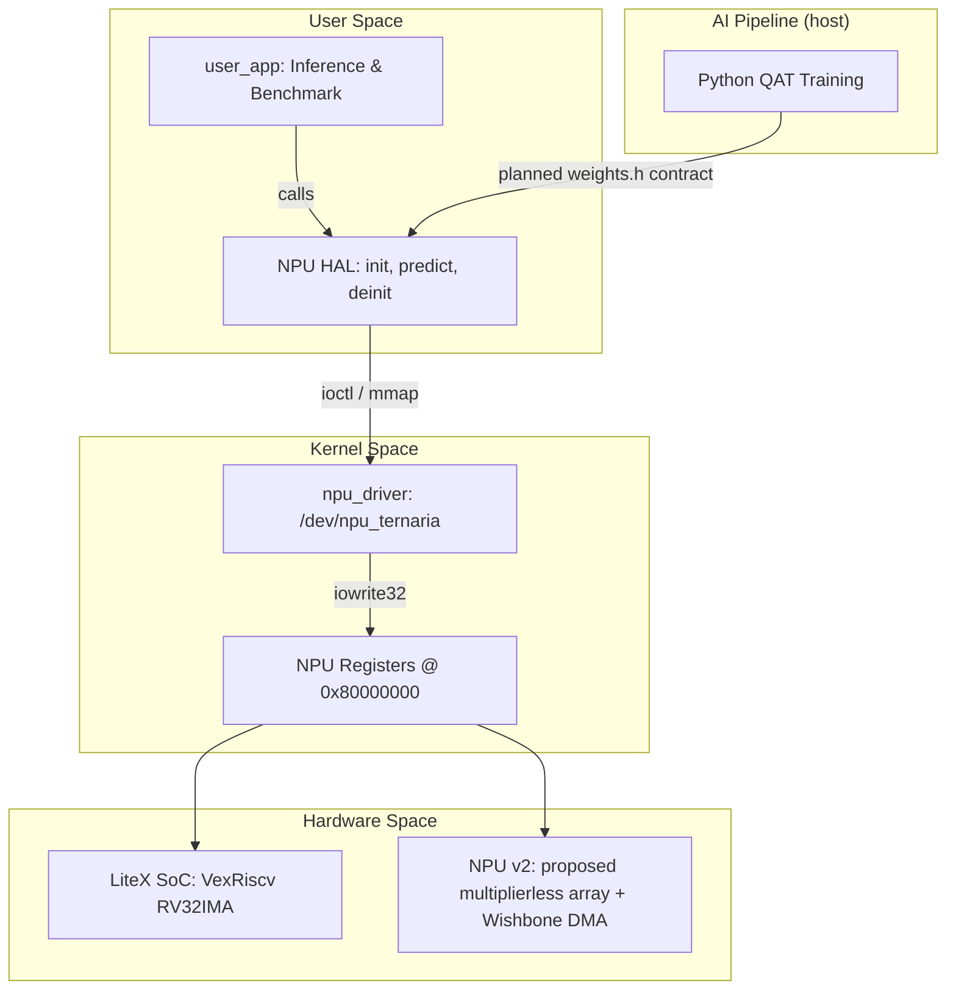

# Ternary Edge-RV: Full-Stack Multiplierless Edge AI Accelerator

[](https://opensource.org/licenses/MIT)
[-blue.svg)]()
[]()
[]()
[](paper/paper1_template.tex)
[-blue.svg)](http://www.realdigital.org/)

**Ternary Edge-RV** is a hardware-software co-design project aimed at studying energy-efficient Edge Artificial Intelligence. This repository contains the proposed full stack, from custom RTL and SoC architecture to the AI application, for a multiplierless Ternary Neural Network (TNN) accelerator targeted for integration into a Linux-capable RISC-V System-on-Chip (SoC).

This project is working toward **Phase 4: Physical Deployment and Paper 1** (target: SBCCI/LASCAS). The paper template is available at [`paper/paper1_template.tex`](paper/paper1_template.tex). The research question is whether heavily quantized models ($\in \{-1, 0, 1\}$) on custom hardware can improve latency and energy use relative to CPU execution; that comparison remains subject to physical measurement.

> **Historical snapshot (17/08/2026):** Earlier project notes recorded the RealDigital Urbana board (AMD Spartan-7 XC7S50-CSGA324, 128 MB DDR3, MicroSD) connected via micro-USB with FTDI FT2232H detected, JTAG IDCODE 0x362f093 verified, and `/dev/ttyUSB0` / `/dev/ttyUSB1` created. Those notes also recorded a 4/4 Verilog regression result and updated OpenXC7 flags (`-nolutram -nowidelut`). The 4/4 result is retained as dated history, not as current evidence from the present shell. The target completion date for SBCCI/LASCAS submission was 31/08/2026. The operational transition plan is defined in [`docs/planejamento/direcionamento_pos_gilvan.md`](docs/planejamento/direcionamento_pos_gilvan.md).

---

## 🎯 Project Overview & Academic Contribution

Traditional AI inference relies heavily on power-hungry floating-point Multiply-Accumulate (MAC) operations. **Ternary Edge-RV** is designed to avoid hardware multipliers for ternary operations; synthesis and runtime evidence are still pending.

By using **Quantization-Aware Training (QAT)** and the **Straight-Through Estimator (STE)**, we constrain neural network weights to ternary values (-1, 0, 1). This mathematical simplification is intended to let the custom Neural Processing Unit (NPU) perform dense-layer operations using basic adders, subtractors, and multiplexers.

However, deploying raw hardware in isolation is commercially unviable for IoT and Edge systems (e.g., nano-drones), which require networking and file system abstractions. Our research proposes a **Co-Design approach**: offloading neural computation to a Ternary NPU while retaining a lightweight **LiteX-generated VexRiscv SoC** targeted to run an **Embedded Linux OS**. The documented integration uses IRQ-driven Memory-Mapped I/O (MMIO) and is intended to avoid CPU polling, but CPU sleep, latency, power, and energy benefits await runtime, synthesis, and physical measurement.

### Key Innovations
* **Multiplierless Hardware:** The source-level design and host-side model use addition, subtraction, multiplexing, and zero-skipping for ternary operations. Physical DSP utilization awaits synthesis and a resource report.
* **NPU HAL Layer:** A documented but incomplete Hardware Abstraction Layer intended to bridge the kernel driver and user application. DMA buffer management, weight loading, and CPU-based output classification still require end-to-end HAL, weights, and data-contract validation.
* **Custom Linux Kernel Driver:** Source-level User-Space to Kernel-Space interfaces use custom `.ko` modules, MMIO, and an IRQ path. Physical interrupt behavior and any reduction in CPU polling remain unverified.
* **Benchmarking Plan:** `<sys/time.h>` profiling and CPU versus NPU comparison paths are documented, but latency, throughput, power, and energy results await a validated physical run.
* **Automated AI Pipeline:** A Python-based QAT pipeline packs 2-bit ternary weights into 32-bit headers. Gustavo owns its current maintenance and the `weights.h` contract. The current header contains the FP32 symbols, but its fallback values, including `0.01` and `0.1`, are not validated trained parameters.

---

## 🏗️ System Architecture

The proposed project stack connects the AI application to the target hardware through the documented software, hardware, and host-side pipeline components below:



### Why a HAL?

The planned NPU v2 is **purely ternary** and is intended to compute {+1, 0, -1} × INT8 operations. The final classification layer (256→10) is documented as requiring FP32 weights and softmax on the CPU. The HAL exposes the intended `npu_init()` → `npu_predict()` → `npu_deinit()` interface, but its end-to-end contract with the exported weights and data transforms remains incomplete.

### Address and Evidence Boundary

Current LiteX documentation uses `0x80000000` as the candidate NPU MMIO base. Older map snapshots use `0x40000000`. This conflict is unresolved and must be validated against the generated LiteX map, RTL, Device Tree, driver, and HAL before either address is treated as final. The 64-MAC array, zero-DSP goal, throughput, and speedup are design intent or pending synthesis and measurement, not physical results.

---

## 📂 Repository Structure

The repository is organized by domain to ensure a clear separation of concerns:

```text
TernaryEdge-RV/
├── docs/                   # Internal documentation, architecture specs, and planning
├── hardware/               # Hardware Engineering
│   ├── litex_soc/          # Python scripts for VexRiscv SoC generation via LiteX
│   └── npu_rtl/            # Verilog/VHDL source for the Ternary NPU and Testbenches
├── software/               # OS and Driver Stack
│   ├── os_buildroot/       # Buildroot configs, Patches, U-Boot, and Device Tree (.dts)
│   ├── npu_driver/         # LKM C source code, file_operations, and MMIO mapping
│   ├── npu_hal/            # NPU HAL: init, load_weights, predict, classifier, weights
│   └── user_app/           # User-space C application using the HAL API
├── ai_training/            # AI & Quantization Pipeline
│   ├── notebooks/          # QAT exploration and model training (Larq/Brevitas)
│   └── scripts/            # Automated extraction and weight packing (uint32_t)
└── paper/                  # LaTeX source code, planned benchmark artifacts, and references
```

---

## 📊 Current Operational Status

The current evidence boundary and active post-Gilvan organization are documented in [`docs/planejamento/direcionamento_pos_gilvan.md`](docs/planejamento/direcionamento_pos_gilvan.md). The four-author Paper 1 list remains unchanged and in the order Arthur, Gildo, Gustavo, Gilvan.

Current evidence is limited to C++ Golden Model v1 with 8/8 checks, C++ Golden Model v2 with 21/21 checks, Python pipeline with 5/5 checks, and a passing IOCTL ABI check. The Verilog testbench is unavailable in the current shell. There is no proven FPGA end-to-end inference or benchmark, and no physical CPU-versus-NPU result.

| Domain | Active Operational Ownership | Current Status & Evidence |
|:-------|:-----------------------------|:--------------------------|
| **Hardware (RTL/SoC)** | Arthur Oliveira Gomes | Verilog testbench unavailable in the current shell; historical 4/4 record retained as dated history. Urbana board connection and OpenXC7 flag changes are recorded, but synthesis and bitstream remain pending. |
| **Linux, OS & HAL** | Gildo Alves de Lima Junior | Buildroot infrastructure, Device Tree (`urrbana.dts`), NPU HAL (`libnpu_hal.a`), FP32 CPU Classifier, MicroSD preparation, Linux physical boot. |
| **AI Pipeline, Weights, Golden Model, Driver & Benchmarks** | Gustavo Alexandre dos Santos | Current AI pipeline maintenance, weight export and `weights.h` contract, Golden Model regression and maintenance, kernel driver, RV32 cross-compilation, physical validation coordination, CPU-versus-NPU benchmarks, and Paper 1 results and discussion. Historical QAT, ternary packing, and C++ Golden Model v2 contributions remain under Gilvan's credit. |
| **Paper 1 Authors** | Arthur, Gildo, Gustavo, Gilvan | All 4 original authors retained on paper submission draft for SBCCI/LASCAS (31/08/2026). |

### Arthur (Hardware): RTL, LiteX SoC, Verilog Regression, Synthesis & Bitstream
- ✅ **Phase 1 design record:** Current LiteX documentation uses `0x80000000` as the candidate NPU MMIO base; older records use `0x40000000`. The generated map, RTL, Device Tree, driver and HAL still require cross-layer validation. IRQ 10 and Little-Endian remain design parameters.
- ✅ **Phase 2:** `ternary_mac.v` multiplierless MAC, `npu_ternaria_top.v` v1 (Wishbone slave + FSM + IRQ).
- ✅ **Phase 3 design target:** NPU v2 64-MAC array (`ternary_mac_array.v`), 6-stage adder tree (`adder_tree_64.v`), Wishbone Master DMA (`wishbone_master.v`), 12K-word weight BRAM, FSM Layer Sequencer (784->1024->512->256). Integration and synthesis remain pending.
- ✅ **Phase 4 (Status 17/08/2026):**
  - ⏳ Verilog RTL testbench execution is unavailable in the current shell. The historical 4/4 report is retained above as a dated snapshot.
  - ✅ Board connection evidence: RealDigital Urbana connected via micro-USB, FTDI FT2232H chip detected, JTAG IDCODE 0x362f093 (Spartan-7 XC7S50), `/dev/ttyUSB0` and `/dev/ttyUSB1` created.
  - ✅ OpenXC7 synthesis flags updated to `-nolutram -nowidelut` in platform to eliminate RAM256X1S and MUXF7/MUXF8 chains.
  - ⏳ Bitstream generation and physical hardware loading targeted for 31/08/2026 deadline.

### Gildo (OS Infrastructure & HAL): Buildroot, Device Tree, HAL, Classifier & Linux Boot
- ✅ **Infrastructure & Buildroot:** RV32IMA defconfig, toolchain via `make sdk`, QEMU boot validation.
- ✅ **Device Tree & Config:** `urrbana.dts` target Device Tree, `CONFIG_HIGH_RES_TIMERS=y`, FAT32/ext4 RootFS support.
- ✅ **NPU HAL & Classifier (`libnpu_hal.a`):** `npu_hal.c`, `npu_classifier.c` (FP32 CPU fallback for 256->10 output layer), `npu_weights.c`.
- ✅ **Packages & Application:** Buildroot packages (`npu-ternaria`, `npu-hal`, `user-app`), `user_app.c` refactored with `--cpu`, `--file`, `--batch` flags.
- ⏳ **Phase 4 Deployment (17/08/2026):** MicroSD card preparation, final Buildroot image compilation (kernel 6.18.7 + OpenSBI 1.6 + RootFS), Linux physical boot on Urbana board.

### Gustavo (AI Pipeline, Weights, Golden Model, Driver & Benchmarks): Current Operational Owner
- ✅ **AI and model maintenance:** Owns the current Python pipeline, `weights.h` export contract, and C++ Golden Model regression and maintenance.
- ✅ **Current host evidence:** Python pipeline 5/5 checks, C++ Golden Model v1 8/8 checks, C++ Golden Model v2 21/21 checks, and IOCTL ABI check passing.
- ✅ **Kernel Driver (`npu_driver.ko`):** Platform driver with `dma_alloc_coherent`, `mmap`, `devm_request_irq`, `wait_event_interruptible`.
- ✅ **Driver v3.0 Register Map:** 10 MMIO registers (`0x00`-`0x24`), `iowrite32` for `WEIGHT_CFG`/`ACT_CFG`/`MAC_CFG`/`LAYER_CFG`, shared `npu_ioctl.h`.
- ✅ **Weights and export contract:** Maintains `weights.h`, the AI export format, and the RV32 cross-compilation workflow. The current FP32 symbols use fallback values and are not validated trained parameters.
- ⏳ **Physical validation coordination:** Coordinates the driver, RV32 cross-compilation, physical validation with Arthur and Gildo, CPU-vs-NPU benchmarks, and the Paper 1 results and discussion. No FPGA end-to-end inference or benchmark is currently proven.

### Gilvan (Historical AI Contribution): Retained & Credited
- ✅ Historical QAT pipeline (Larq + STE), ternary packing, and C++ Golden Model v2 retained in the repository record.
- ✅ Historical C++ Golden Model v2 result retained as 21/21 host-side checks; current regression maintenance belongs to Gustavo.
- ✅ Retained as 4th author on Paper 1.

### Active Target & Deadline
- **Target completion date:** 31/08/2026 for SBCCI/LASCAS submission.

---

## 🚀 Getting Started (Simulation & Deployment)

*(Detailed phase-by-phase execution instructions are located in the respective subdirectories).*

### 1. Prerequisites
* **Hardware:** Vivado/Quartus toolchains, LiteX environment, Verilator (for simulation).
* **Software:** Buildroot, 32-bit RISC-V Cross-Compiler (`riscv32-buildroot-linux-gnu-gcc`), QEMU.
* **AI:** Python 3.10+, TensorFlow 2.17+, Larq 0.13+.

### 2. Quick Workflow
1. **Train Model:** Run the Python pipeline in `ai_training/` to generate `weights.h`.
2. **Build OS:** Compile the Buildroot environment in `software/os_buildroot/` to generate the RootFS and Toolchain.
3. **Build HAL + user_app:** Cross-compile the NPU HAL and user application.
4. **Compile Driver:** Cross-compile the LKM in `software/npu_driver/`.
5. **Hardware Synthesis:** Generate the bitstream using LiteX in `hardware/` and flash your target FPGA.
6. **Run Inference after physical validation:** Boot Linux on the FPGA, load the driver (`insmod`), and execute the benchmark application.

### 3. Software Stack Architecture

```
user_app (inference + benchmark)
    │
    ▼  (uses)
NPU HAL (npu_init → npu_predict → npu_deinit)
    │  └─ npu_classifier (256→10 output layer)
    │  └─ npu_weights (weight loading)
    │
    ▼  (ioctl / mmap)
npu_driver (/dev/npu_ternaria, IRQ, DMA)
    │
    ▼  (Wishbone bus)
NPU v2 source-level design (64-MAC design target, Layer Sequencer)
```

### 4. AI Pipeline (ai_training/)

The AI pipeline uses **Larq** for Quantization-Aware Training with the Straight-Through Estimator (STE), producing strictly ternary weights `{-1, 0, +1}`.

```bash
# Run the full pipeline (train -> validate -> pack -> export)
cd ai_training
python3 scripts/run_pipeline.py
```

The pipeline is intended to generate `weights.h` for the NPU HAL, but the HAL/weights contract is incomplete and requires end-to-end validation:
- `quant_dense_weights[50176]`: Layer 0 (784->1024)
- `quant_dense_1_weights[32768]`: Layer 1 (1024->512)
- `quant_dense_2_weights[8192]`: Layer 2 (512->256)
- `output_weights[2560]`: Output layer FP32 symbol present in the current header, but fallback values are not validated trained parameters
- `output_bias[10]`: Output layer bias symbol present in the current header, but fallback values are not validated trained parameters

---

## 🔧 Target Hardware: RealDigital Urbana (Phase 4)

The project targets the **RealDigital Urbana** board, which satisfies all `requisitos_fpga.md` requirements:

| Component | Urbana Board | Project Requirement |
|:----------|:-------------|:--------------------|
| FPGA | AMD Spartan-7 **XC7S50-CSGA324** | Xilinx 7-series (Wishbone + LiteX) |
| Logic Cells | ~52K LUTs | >= 15K (VexRiscv Linux + NPU) |
| External RAM | 128 MB DDR3; address range requires validation against the generated LiteX map | >= 32 MB (Linux + RootFS) |
| Storage | MicroSD slot | Boot + RootFS (FAT32 + ext4) |
| Console | UART via FTDI micro-USB | Linux console @ 115200 baud |
| Programmer | FTDI over micro-USB | openFPGALoader / Vivado Hardware Manager |

### Hardware Synthesis (Arthur)

Two supported toolchains for the Spartan-7:

**Option A: Xilinx Vivado Design Suite 2026.1 (Spartan-7 + free Basic license):**
```bash
cd /home/arthur/Documents/Projects/TernaryEdge-RV
nix develop .#vivado
cd hardware/litex_soc
python3 base_soc.py --build --toolchain vivado  # Synthesize -> bitstream
python3 base_soc.py --load       # Load bitstream to SRAM (volatile)
python3 base_soc.py --flash      # Flash bitstream to SPI flash (persistent)
```

Vivado 2026.1 requires the free annual Vivado Basic license for synthesis and
implementation. Generate it in the AMD licensing portal and load the `.lic`
file into `~/.Xilinx` before building.

**Option B: Open-source toolchain (openXC7: yosys + nextpnr-xilinx + openFPGALoader):**
```bash
# Recommended on NixOS: use the repository-local flake
nix develop .#hardware
ternaryedge-setup-openxc7

# Build and flash
cd hardware/litex_soc
python3 base_soc.py --build --toolchain openxc7
python3 base_soc.py --load   # SRAM test (volatile)
python3 base_soc.py --flash  # SPI flash (persistent)
```

The flake provides the openXC7 database, `bbaexport`/`bbasm`, and the `xc7frames2bit` build. OpenXC7 synthesis flags in the platform configuration are updated to `-nolutram -nowidelut` to eliminate RAM256X1S and MUXF7/MUXF8 chains. Before synthesis, `ternaryedge-check-litex-board` must pass.

### SD Card Preparation (Gildo)

Two partitions on the MicroSD card:
- **Partition 1 (FAT32, ~64 MB):** `boot.json` + `boot.scr` (U-Boot) + Linux kernel `Image` + `rv32.dtb` (LiteX-generated, based on `urrbana.dts`)
- **Partition 2 (ext4, rest):** Buildroot RootFS including `/lib/modules/<ver>/npu_driver.ko`, `/usr/lib/libnpu_hal.a`, `/usr/bin/user_app`, `/root/mnist/*.raw` (test images)

### Planned FPGA Boot & Inference (Gildo with Gustavo coordinating validation)

No FPGA end-to-end inference or CPU-vs-NPU benchmark has been proven. The commands below are an acceptance procedure, not evidence of completed execution.

```bash
# On Urbana UART console (via micro-USB FTDI @ 115200):
# 1. OpenSBI -> U-Boot -> Linux boot from mmcblk0p2

# 2. Load the NPU kernel module
insmod npu_driver.ko
dmesg | grep npu         # Expect "NPU v2 probe successful. /dev/npu_ternaria ready"

# 3. Run baseline CPU inference (3-layer ternary MLP in software, no NPU)
./user_app --cpu --file /root/mnist/sample_7.raw

# 4. Run proposed NPU-accelerated inference after the physical path is validated
./user_app --file /root/mnist/sample_7.raw
#  Output: predicted class, confidence, time_copy_us, time_npu_us, time_output_us, time_total_us

# 5. Batch benchmark after validation (100 images) -> save CSV for Paper 1
./user_app --batch 100 --file /root/mnist/batch/  > benchmark_npu.csv
./user_app --cpu --batch 100 --file /root/mnist/batch/ > benchmark_cpu.csv
```

---

## 👥 The Team

This research project is collaboratively developed by:

* **Arthur Oliveira Gomes** - *Hardware Architecture, RTL & SoC Design* (Hardware RTL, LiteX SoC, Verilog regression, openXC7/Vivado synthesis, Bitstream generation)
* **Gildo Alves de Lima Junior** - *OS Infrastructure & NPU HAL* (Buildroot, Device Tree urrbana.dts, NPU HAL libnpu_hal.a, FP32 CPU Classifier, MicroSD preparation, Linux physical boot)
* **Gustavo Alexandre dos Santos** - *AI Pipeline, Weights, Golden Model, Kernel Driver & Benchmarking* (AI pipeline maintenance, weights.h contract and export, Golden Model regression, kernel driver npu_driver.ko, RV32 cross-compilation, physical validation coordination, CPU versus NPU benchmarks, Paper 1 results and discussion)
* **Gilvan Alves Pastor Junior** - *Historical Artificial Intelligence & Golden Model Contribution* (Historical QAT pipeline Larq/STE, ternary packing, C++ Golden Model v2 retained and credited)

---

## 📝 Citation

If you find this repository useful for your research, please consider citing our upcoming paper. The Paper 1 LaTeX template with full author list and section outline is at [`paper/paper1_template.tex`](paper/paper1_template.tex).

```bibtex
@article{TernaryEdgeRV2026,
  title={Ternary Edge-RV: A Multiplierless Ternary Neural Network Accelerator for RISC-V Linux Systems},
  author={Arthur Oliveira Gomes and Gildo Alves de Lima Junior and Gustavo Alexandre dos Santos and Gilvan Alves Pastor Junior},
  journal={TBD (SBCCI/LASCAS)},
  year={2026}
}
```

## 📄 License

This project is licensed under the MIT License - see the `LICENSE` file for details.
