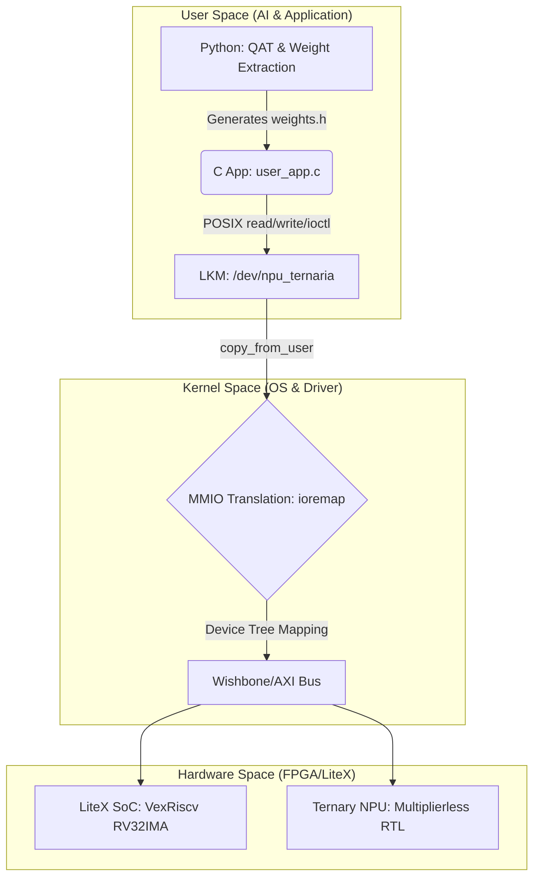

# Ternary Edge-RV: Full-Stack Multiplierless Edge AI Accelerator

[](https://opensource.org/licenses/MIT)
[-blue.svg)]()
[]()
[]()
[](paper/paper1_template.tex)

**Ternary Edge-RV** is a complete hardware-software co-design project aimed at achieving extreme energy efficiency for Edge Artificial Intelligence. This repository contains the full stack—from custom silicon architecture to the AI application—demonstrating a multiplierless Ternary Neural Network (TNN) accelerator integrated into a Linux-capable RISC-V System-on-Chip (SoC).

This project is currently under active development for academic publication (Paper 1 — target: SBCCI/LASCAS). The paper template is available at [`paper/paper1_template.tex`](paper/paper1_template.tex). It aims to prove that inferencing heavily quantized models ($\in \{-1, 0, 1\}$) on custom hardware without DSPs significantly outperforms CPU-bound execution in both latency and power consumption.

---

## 🎯 Project Overview & Academic Contribution

Traditional AI inference relies heavily on power-hungry floating-point Multiply-Accumulate (MAC) operations. **Ternary Edge-RV** entirely eliminates the need for hardware multipliers. 

By leveraging **Quantization-Aware Training (QAT)** and the **Straight-Through Estimator (STE)**, we constrain neural network weights to ternary values (-1, 0, 1). This mathematical simplification allows our custom Neural Processing Unit (NPU) to perform convolutions and dense layer operations using only basic adders, subtractors, and multiplexers. 

However, deploying raw hardware in isolation is commercially unviable for IoT and Edge systems (e.g., nano-drones), which require networking and file system abstractions. Our research introduces a **Co-Design approach**: offloading the neural computation to the Ternary NPU while retaining a lightweight **LiteX-generated VexRiscv SoC** running an **Embedded Linux OS**. By utilizing a custom **Loadable Kernel Module (LKM)** with strict IRQ-driven Memory-Mapped I/O (MMIO), we eliminate CPU polling, allowing the system to sleep during inference. This proves that high-level OS abstraction can coexist with extreme hardware energy efficiency.

### Key Innovations
* **Multiplierless Hardware:** Zero DSP blocks utilized. Inference is achieved strictly through addition, subtraction, and zero-skipping (sparsity optimization).
* **Custom Linux Kernel Driver:** Seamless User-Space to Kernel-Space bridging using custom `.ko` modules with high-resolution hardware interrupt (IRQ) synchronization, completely eliminating CPU polling overhead.
* **Full-Stack Benchmarking:** Integrated `<sys/time.h>` profiling to directly compare hardware-accelerated latency against software-only CPU execution on the same SoC.
* **Automated AI Pipeline:** A Python-based QAT pipeline that automatically packs 2-bit ternary weights into highly efficient 32-bit headers for execution in C.

---

## 🏗️ System Architecture

The project is divided into four interdependent domains, bridging user applications down to the physical hardware:



---

## 📂 Repository Structure

The repository is organized by domain to ensure a clear separation of concerns:

```text
TernaryEdge-RV/
├── docs/                   # Internal documentation, architecture specs, and planning
├── hardware/               # Hardware Engineering
│   ├── litex_soc/          # Python scripts for VexRiscv SoC generation via LiteX
│   └── npu_rtl/            # Verilog/VHDL source for the Ternary NPU and Testbenches
├── software/               # OS and Driver Stack
│   ├── os_buildroot/       # Buildroot configs, Patches, U-Boot, and Device Tree (.dts)
│   ├── npu_driver/         # LKM C source code, file_operations, and MMIO mapping
│   └── user_app/           # User-space C application for inference and benchmarking
├── ai_training/            # AI & Quantization Pipeline
│   ├── notebooks/          # QAT exploration and model training (Larq/Brevitas)
│   └── scripts/            # Automated extraction and weight packing (uint32_t)
└── paper/                  # LaTeX source code, benchmark graphs, and references
```

---

## 📊 Project Status (Active Development)

<!-- Status updated 2026-06-10 — Fase 3 completa (NPU v2, 29/29 testes) -->

| Domain | Lead | Phase | Status | Completion |
|:-------|:-----|:------|:-------|:-----------|
| **Hardware (RTL/SoC)** | Arthur | 3.5/4 | F1✅ F2✅ F3✅ (NPU v2 done) |  |
| **OS (Buildroot)** | Gildo | 2.5/4 | F1✅ F2✅ F3▶️ |  |
| **Kernel Driver** | Gustavo | 3.5/4 | F1✅ F2✅ F3✅ (v2 adapted) |  |
| **AI Pipeline** | Gilvan | 3.0/4 | F1✅ F2✅ F3✅ (4/5 tasks) |  |

### Arthur (Hardware) — NPU v2: 64 MACs + Wishbone Master DMA
- ✅ **Phase 1:** Official memory map defined (`0x40000000`, IRQ 10, Little-Endian). VexRiscv-RV32IMA base SoC.
- ✅ **Phase 2:** `ternary_mac.v` (multiplierless MAC: 0 DSPs). `npu_ternaria_top.v` v1 (Wishbone slave + FSM + IRQ).
- ✅ **Phase 3 — NPU v2 COMPLETE:**
  - ✅ 64 MAC array (`ternary_mac_array.v`) + 6-stage pipelined adder tree (`adder_tree_64.v`)
  - ✅ Wishbone Master DMA controller (`wishbone_master.v`) — burst reads, classic handshake
  - ✅ 12K-word weight BRAM + 1K activation buffer (`npu_v2_pkg.v`)
  - ✅ Hardware Layer Sequencer — FSM 10 estados, 3 layers (784→1024→512→256)
  - ✅ Verilog testbench (`tb_npu_v2.v`) — RAM simulada, testes registrador/IRQ/STATUS
  - ✅ STATUS register `zero_counter` at bits `[15:8]` — alinhado C++/RTL
  - ✅ Golden Model C++ v2 — 21/21 testes passando
- ⏳ FPGA confirmado pelo professor (E2). Bitstream alvo para Fase 4.

### Gildo (OS) — Buildroot & Device Tree
- ✅ **Phase 1:** Buildroot external tree. RV32IMA defconfig. QEMU boot.
- ✅ **Phase 2:** Toolchain via `make sdk`. HIGH_RES_TIMERS enabled.
- 🚧 **Phase 3:**
  - 【 】 Official `.dts` with NPU v2 node (`compatible = "ternaryedge,npu-ternaria"`, IRQ=10)
  - 【 】 Preencher Config.in e external.mk (atualmente vazios)
  - 【 】 Verificar RootFS para suporte a LKM + user_app
- ⏳ **Fase 4:** SD card image + deploy físico.

### Gustavo (Driver) — Adaptado para NPU v2
- ✅ Platform driver with `dma_alloc_coherent`, `mmap`, `request_irq`, `wait_event_interruptible`.
- ✅ **Adaptação para NPU v2 COMPLETA (npu_driver.c v3.0):**
  - ✅ Offsets revisados (10 registradores, 0x00–0x24)
  - ✅ `iowrite32()` para WEIGHT_CFG + ACT_CFG + MAC_CFG + LAYER_CFG
  - ✅ IOCTL com struct `npu_ioctl_args` (5 campos de configuração)
  - ✅ user_app.c revisado com timing segregado
  - ✅ `mmap.h`→`mman.h` corrigido no dummy_app.c

### Gilvan (AI) — Golden Model v2 + user_app.c real
- ✅ QAT pipeline (Larq + STE). 3 ternary layers. weights.h gerado.
- ✅ **Phase 3 (4/5 tasks):**
  - ✅ STATUS register corrigido para bits `[15:8]` no `npu_sim_v2.cpp`
  - ✅ Golden Model expandido para 64 MACs + DMA simulation (21/21 testes)
  - ✅ user_app.c real implementado (forward pass + timing segregado + baseline CPU)
  - ✅ `.gitignore` atualizado (weights.h excluído)
  - ⚠️ **Pendente:** Testar saída ternária na última layer (Opção A) ou usar CPU fallback (Opção B)

### Known Gaps (updated 10/06/2026)
| Gap | Owner | Priority |
|:----|:------|:---------|
| Output layer FP32 vs hardware ternary | Gilvan (testar Opção A) | **High** |
| No physical FPGA yet | Arthur + Professor | **High** — confirmado, aguardando |
| Device Tree (.dts) para NPU v2 não criado | Gildo | **High** |
| Config.in / external.mk vazios | Gildo | **Medium** |
| QEMU setup usa CPU rv64imafdch (projeto é RV32) | Gildo/Gustavo | **Medium** |

---

## 🚀 Getting Started (Simulation & Deployment)

*(Detailed phase-by-phase execution instructions are located in the respective subdirectories).*

### 1. Prerequisites
* **Hardware:** Vivado/Quartus toolchains, LiteX environment, Verilator (for simulation).
* **Software:** Buildroot, 32-bit RISC-V Cross-Compiler (`riscv32-buildroot-linux-gnu-gcc` or multilib equivalent targeting `rv32ima`), QEMU.
* **AI:** Python 3.10+, TensorFlow 2.17+, Larq 0.13+.

### 2. Quick Workflow
1. **Train Model:** Run the Python pipeline in `ai_training/` to generate `weights.h`.
2. **Build OS:** Compile the Buildroot environment in `software/os_buildroot/` to generate the RootFS and Toolchain.
3. **Compile App & Driver:** Cross-compile the LKM in `software/npu_driver/` and the user application.
4. **Hardware Synthesis:** Generate the bitstream using LiteX in `hardware/` and flash your target FPGA.
5. **Run Inference:** Boot Linux on the FPGA, load the driver (`insmod`), and execute the benchmark application.

### 3. AI Pipeline (ai_training/)

The AI pipeline uses **Larq** for Quantization-Aware Training with the Straight-Through Estimator (STE), producing strictly ternary weights `{-1, 0, +1}` — no scaling factors, ensuring true multiplierless hardware.

```bash
# Run the full pipeline (train -> validate -> pack -> export)
cd ai_training
.venv/Scripts/python.exe scripts/run_pipeline.py

# Or skip training if you have a saved model
.venv/Scripts/python.exe scripts/run_pipeline.py --skip-train

# Adjust training hyperparameters
.venv/Scripts/python.exe scripts/run_pipeline.py --epochs 30 --lr 5e-4
```

| Script | Purpose |
|---|---|
| `train_qat_mnist.py` | Standalone QAT training with Larq `ste_tern` quantizer |
| `pack_weights.py` | Utility: pack 16 ternary weights into a single `uint32_t` |
| `generate_weights_h.py` | Generate C header `weights.h` from trained model |
| `run_pipeline.py` | **Unified pipeline**: train → validate → pack → export |
| `notebooks/qat_exploration.ipynb` | Interactive notebook for experimentation |

---

## 👥 The Team

This research project is collaboratively developed by:

* **Arthur Oliveira Gomes** - *Hardware Architecture & RTL Design* (LiteX, Verilog, SoC Generation)
* **Gildo Alves de Lima Junior** - *OS Infrastructure* (Buildroot, Kernel Configuration, Device Tree)
* **Gustavo Alexandre dos Santos** - *Kernel Driver Development* (LKM, MMIO, Hardware Synchronization)
* **Gilvan Alves Pastor Junior** - *Artificial Intelligence & User Space* (QAT, C Application, Benchmarking)

---

## 📝 Citation

If you find this repository useful for your research, please consider citing our upcoming paper. The Paper 1 LaTeX template with full author list and section outline is at [`paper/paper1_template.tex`](paper/paper1_template.tex).

```bibtex
@article{TernaryEdgeRV2026,
  title={Ternary Edge-RV: A Multiplierless Ternary Neural Network Accelerator for RISC-V Linux Systems},
  author={Arthur Oliveira Gomes and Gildo Alves de Lima Junior and Gustavo Alexandre dos Santos and Gilvan Alves Pastor Junior},
  journal={TBD (SBCCI/LASCAS)},
  year={2026}
}
```

## 📄 License

This project is licensed under the MIT License - see the `LICENSE` file for details.
